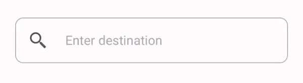

## Material Design Search UI iOS
Material design styled search UI consists of search bar and search results view.

[](https://shields.io/) [](https://shields.io/)  [](https://shields.io/)  [](https://shields.io/) 


You may see the following [Medium](https://medium.com/) articles for how detailed explanation of developing these UI widgets.

- [Create Material Design Search Bar in iOS — Search UI Part 1/3](https://medium.com/swlh/create-material-design-search-bar-in-ios-search-ui-part-1-3-dfb905de6b01)
- [Create Material Design Search Results View in iOS — Search UI Part 2/3](https://medium.com/swlh/create-material-design-search-results-view-in-ios-search-ui-part-2-3-21c43f0617c)
- [Create Material Design Search UI in iOS — Search UI Part 3/3](https://medium.com/@twho/create-material-design-search-ui-in-ios-search-ui-part-3-3-a367349f5227)

## Key Features
- A Material Design search bar with delegation method for view controller use.
- A Material Design and enum-driven search results view that clearly defines results view states. 
- Widget classes are made to be **open**, which gives you flexibility to create your own.
- A simple location searching application using the above two widgets is included in the project.

## Requirements
- Swift 5.0
- iOS 11.0+

## Usage
### Search bar
#### Declaration
```swift
var searchbar: Searchbar!
searchbar = Searchbar(
    onStartSearch: {
        // Your implementation
    },
    onClearInput: { 
        // Your implementation
    },
    delegate: self
)
```
#### Delegate methods
```swift
extension MainViewController: SearchbarDelegate {

    func searchbarTextDidChange(_ textField: UITextField) {
    
    }
    
    func textFieldDidBeginEditing(_ textField: UITextField) {
    
    }

    func textFieldDidEndEditing(_ textField: UITextField) {
    
    }

    func searchbarTextShouldReturn(_ textField: UITextField) -> Bool {
        return true
    }
}
```


### Search results view
#### Declaration
```swift
var searchResultsView: SearchResultsView!
searchResultsView = SearchResultsView(didSelectAction: { 
    // Your implementation
})
```


#### Load data into results view
```swift
searchResultsView.update(newPlacemarks: placemarks, error: error)
```

Note: I use CLPlacemark here, you can change to whatever data type you'd like to use in your app.

## Credits
* [Material Design](https://material.io/design/)
* [Le Van Nghia](https://github.com/sharad-paghadal/MaterialKit/tree/master/Source)
* [Icons8](https://icons8.com/)
* [Robert Chen](https://www.thorntech.com/2016/01/how-to-search-for-location-using-apples-mapkit/)
